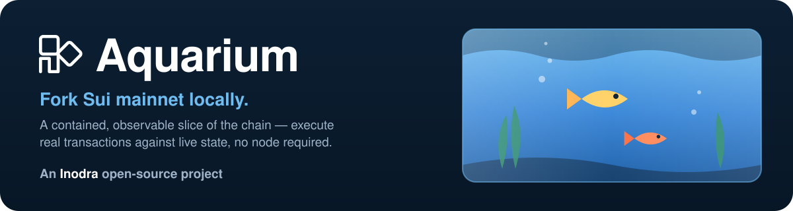

<p align="center">
  
</p>

<p align="center">
  <a href="https://github.com/inodrahq/aquarium/actions/workflows/ci.yml"></a>
  <a href="./LICENSE"></a>
  
  
</p>

<h1 align="center">🐠 Aquarium</h1>

<p align="center"><b>Fork Sui mainnet locally.</b> A contained, observable slice of the chain you can poke at without touching the real ocean.</p>

---

Aquarium is to Sui what `anvil --fork-url` is to EVM. It takes **live mainnet
object state** and lets you execute **new transactions** against it locally —
no validators, no consensus, no multi-terabyte snapshot. State is fetched
**lazily on demand** (through Sui's public GraphQL) and cached; transactions you
run mutate a local **overlay** while the real chain stays untouched.

```console
$ aquarium demo --sender 0x1a66…41dd --coin 0xff21…d916 --repeat 4
  tx   1: v920844983 -> v920844984  [SUCCESS]
  tx   2: v920844984 -> v920844985  [SUCCESS]
  tx   3: v920844985 -> v920844986  [SUCCESS]
  tx   4: v920844986 -> v920844987  [SUCCESS]

overlay coin (locally produced after 4 tx(s)):
  version  920844987  (mainnet fork point was 920844983)
# → version 920844987 is NotFound on mainnet: the fork advanced, the chain didn't.
```

## Contents

- [Why a fork?](#why-a-fork)
- [Install](#install)
- [Use](#use)
- [Verifying it's real](#verifying-its-real)
- [How it works](#how-it-works)
- [Aquarium vs. anvil](#aquarium-vs-anvil)
- [Status & limitations](#status--limitations)
- [Contributing](#contributing) · [Security](#security) · [License & attribution](#license--attribution)

## Why a fork?

Two halves of "fork the chain and keep going":

- **State is cheap to fetch.** Sui transactions declare their input objects, and
  the Move VM is deterministic given `(inputs, protocol config)`. So Aquarium
  fetches exactly the objects a transaction touches and executes locally.
- **Consensus is skipped.** Continuing the real chain would mean replacing
  mainnet's validator committee with a local one. Aquarium doesn't try — like
  Anvil it is its own trivial sequencer. You lose consensus timing and validator
  economics; you keep faithful Move execution against real state.

See [`DESIGN.md`](./DESIGN.md) for the full architecture.

## Install

**One-liner (prebuilt binary, no Rust needed):**

```bash
curl -fsSL https://raw.githubusercontent.com/inodra/aquarium/main/install.sh | sh
```

Downloads the binary for your platform (macOS / Linux, x86_64 / arm64) from
GitHub Releases, verifies its checksum, and drops it on your PATH. Override with
`AQUARIUM_VERSION` / `AQUARIUM_INSTALL_DIR`.

**With Cargo (builds from source):**

```bash
cargo install --git https://github.com/inodra/aquarium aquarium --locked
```

First build compiles the Sui execution tree (a few minutes). Add
`--no-default-features` for a lightweight, read-only binary (no Move VM).

**Docker:**

```bash
docker run --rm ghcr.io/inodra/aquarium info
```

**From source:**

```bash
git clone https://github.com/inodra/aquarium && cd aquarium
cargo build --release                  # full binary (incl. the Move VM)
cargo build --no-default-features      # read-only fork (lightweight, faster)
```

## Use

```bash
# Fork metadata: chain id, latest checkpoint, fork point + epoch
aquarium info

# Read any object as the fork sees it (overlay first, else mainnet@fork)
aquarium object --id 0x6                          # the Clock
aquarium object --id 0x5 --checkpoint 288207778   # at a pinned checkpoint

# Execute transaction(s) against the fork (full binary only).
# Runs gas-only tx(s) and shows the overlay mutate while mainnet doesn't.
# --repeat N chains N transactions, each consuming the previous one's output.
aquarium demo \
  --sender 0x1a66…41dd \
  --coin   0xff21…d916 \
  --checkpoint 288207778 \
  --repeat 4
```

| Command | What it does |
|---|---|
| `info` | Chain id, latest checkpoint, chosen fork point + its epoch. |
| `object --id <id>` | Read an object as the fork sees it (overlay first, then mainnet). |
| `demo` | Execute gas-only transaction(s) and prove fork isolation. |

The library API (`Fork`, `Fork::execute` / `simulate`, `OverlayStore`, `engine::Vm`)
lets you build your own transactions and drive the fork programmatically.

## Verifying it's real

Aquarium reads through Sui's GraphQL endpoint; we verify against the
**independent public gRPC fullnode** so the two never share a path.

```bash
# 1. What Aquarium reads at the fork point …
aquarium object --id 0x6 --checkpoint 288207778
#   version 849923153  digest F9xTJRi2GTL2KEt4f22dn2jUec8LvA7yF83iNBbmJth2

# 2. … is the chain's object, byte for byte:
grpcurl -d '{"object_id":"0x0000…0006","version":849923153,
             "read_mask":{"paths":["digest"]}}' \
  fullnode.mainnet.sui.io:443 sui.rpc.v2.LedgerService.GetObject
#   "digest": "F9xTJRi2GTL2KEt4f22dn2jUec8LvA7yF83iNBbmJth2"   ✅ identical
```

After `aquarium demo`, the gas coin's **new** version is `NotFound` on mainnet
gRPC — the fork advanced its state without touching the real chain.

## How it works

```
   new tx ─▶ Fork::execute ─▶ Vm (sui-execution Move VM)
                 │                │
                 │                ▼
                 │         RuntimeStore  (sui_types storage traits)
                 ▼                │
            OverlayStore ◀────────┘  reads
             ├─ local writes (in-memory, latest version)
             └─ fallthrough ▼
                        DataStore (Mysten GraphQL)  @ pinned checkpoint
```

- **`OverlayStore`** — reads resolve overlay-first, then mainnet@checkpoint;
  executed-tx outputs are committed into the overlay atomically.
- **`RuntimeStore`** — adapts the overlay to the Move VM's storage traits;
  child/dynamic-field loads read through on demand.
- **`Vm` / `Fork`** — a serial sequencer: resolve inputs → execute → commit.

Full detail and the reuse-vs-build breakdown are in [`DESIGN.md`](./DESIGN.md).

## Aquarium vs. anvil

| | `anvil --fork-url` (EVM) | Aquarium (Sui) |
|---|---|---|
| State source | lazy `eth_getStorageAt` | lazy GraphQL object reads |
| Execution | EVM | real Move VM (`sui-execution`) |
| Consensus | none (instant mine) | none (serial sequencer) |
| Snapshot needed | no | no |
| Mutates mainnet | no | no |

## Status & limitations

Working **proof of concept**. Reads are verified byte-for-byte against mainnet;
transaction execution runs the real Move VM and chains correctly. Known scope:

- No consensus, no epoch advancement, no validator set.
- Like Sui transaction replay, input objects are taken at the versions the
  transaction pins (validation bypassed) — build transactions against current
  object versions (the `demo` re-reads the gas coin each round).
- No JSON-RPC/gRPC server yet; the engine is built to back one (see `DESIGN.md`).
- Linux release binaries are glibc; Alpine/musl users build via `cargo install`.

## Contributing

PRs welcome — see [`CONTRIBUTING.md`](./CONTRIBUTING.md) for build, test, and
style (`cargo fmt` + `cargo clippy -D warnings` + `cargo test`, both feature
sets). Please read the [Code of Conduct](./CODE_OF_CONDUCT.md).

## Security

Aquarium is a developer tool that **bypasses transaction validation** to replay
against real state — never use it to sanction or authorize anything on the live
chain. Report vulnerabilities per [`SECURITY.md`](./SECURITY.md).

## License & attribution

Licensed under the **Apache License 2.0** ([`LICENSE`](./LICENSE)).

Aquarium is built on, and links against, **Mysten Labs'** Sui crates
(`sui-data-store`, `sui-types`, `sui-execution`), and its execution glue is
**adapted from** Mysten's `sui-replay-2`. Those portions remain copyright Mysten
Labs, Inc. under Apache-2.0; see [`NOTICE`](./NOTICE) for the full attribution.
Sui and Move are projects of Mysten Labs — Aquarium is an independent tool and is
not affiliated with or endorsed by Mysten Labs.
